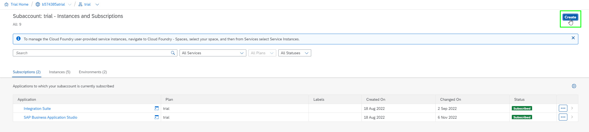

Things you will need to set up:

Create an API runtime instance on BTP

# Create API Runtime Instance

1.  Go to your BTP subaccount.
2.  In the top right-hand corner, click on the ‘Create’ button:  
    
