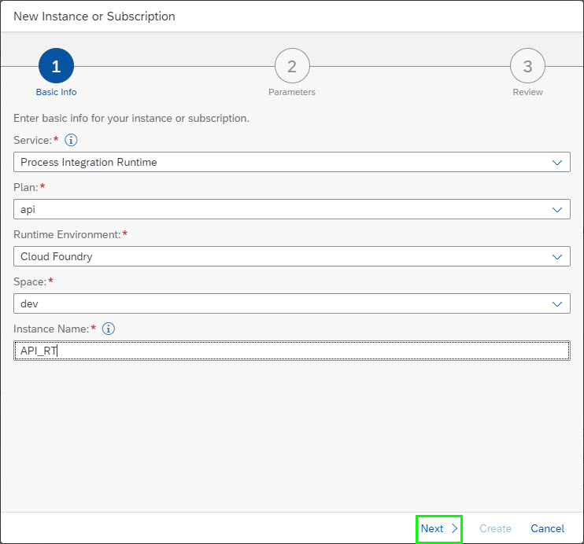
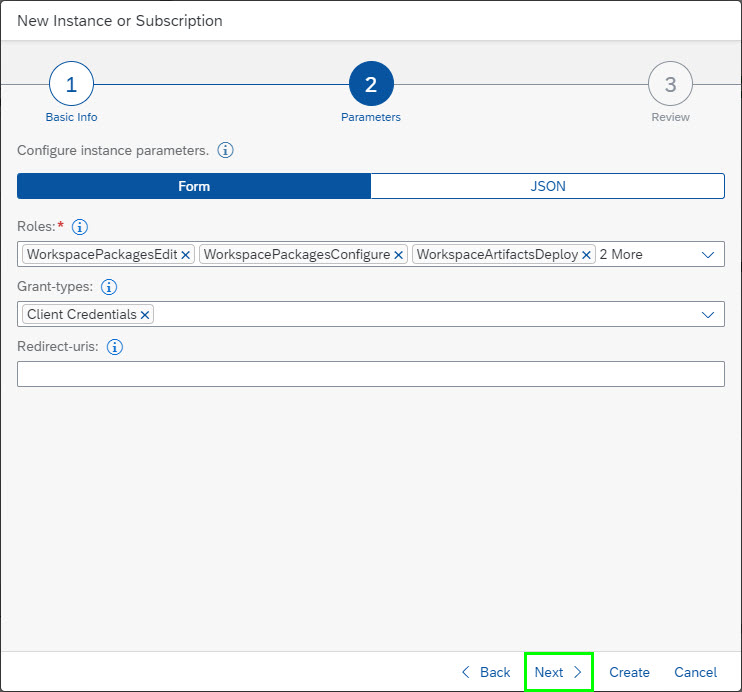
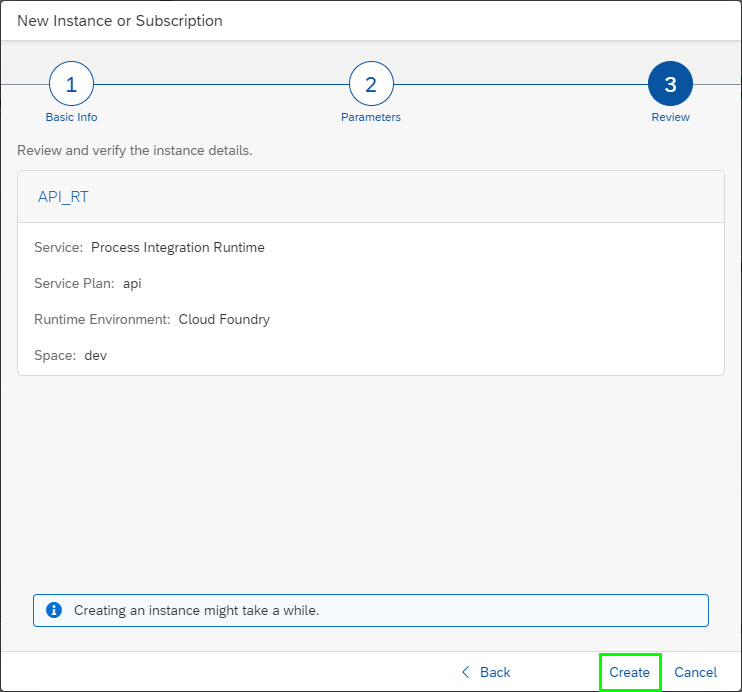
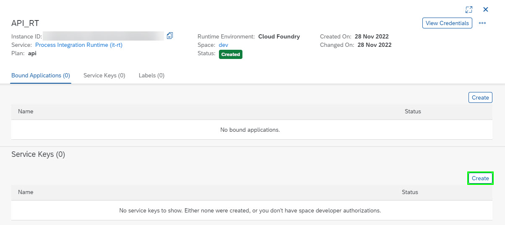
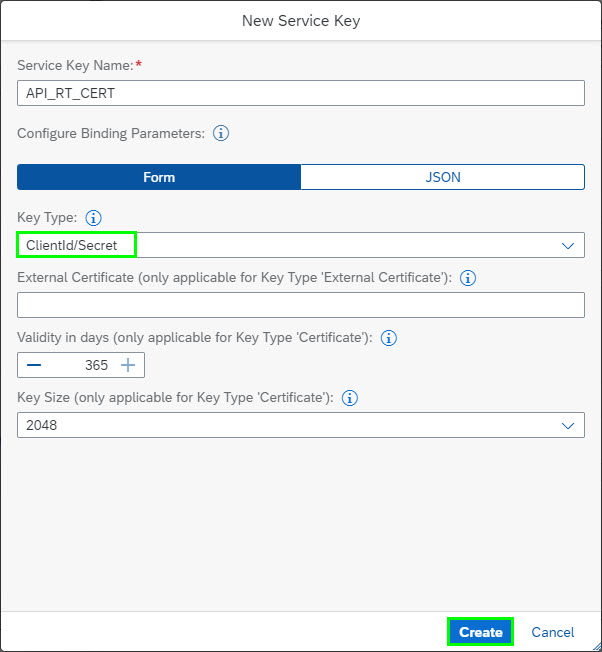
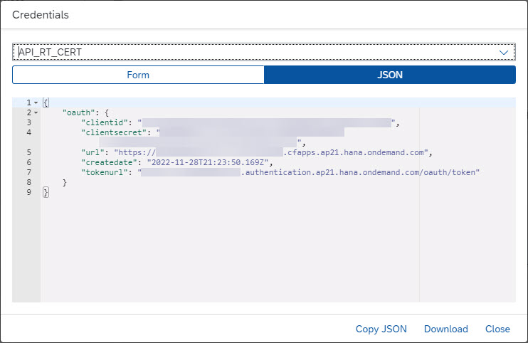

Things you will need to set up:

Create an API runtime instance on BTP

# Create API Runtime Instance

1.  Go to your BTP subaccount.

2.  In the top right-hand corner, click on the ‘Create’ button:  
    

3. Choose 'Process Integration Runtime' for Service, 'api' for Plan, 'Cloud Foundry' for Runtime Environment and a name in Instance Name:

    

4. Press 'Next'.

5. On the next page, select the following Roles:
 - CredentialsEdit
 - WorkspacePackagesRead
 - WorkspacePackagesEdit
 - WorkspacePackagesConfigure
 - WorkspaceArtifactsDeploy

    

6. Press 'Next'.

7. On the next page, check the information and press 'Create':

    

# Create Service Key for API Runtime Instance

1. Choose 'Create' in the Service Keys region of the Runtime Instance:

    

2. Select 'ClientId/Secret' for Key Type:

    

3. Press 'Create'.

4. View the created Service Key and note the Client ID and Client Secret:

    

    

    
